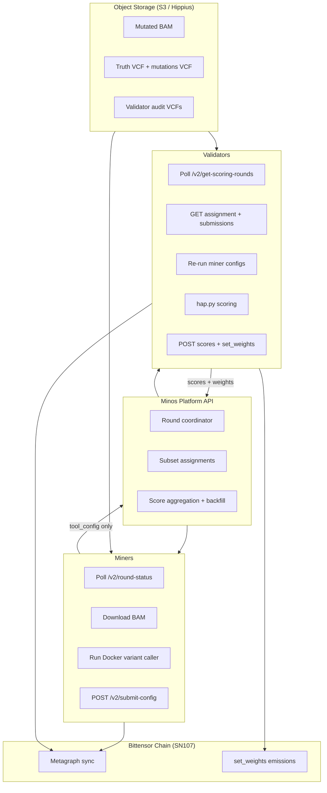
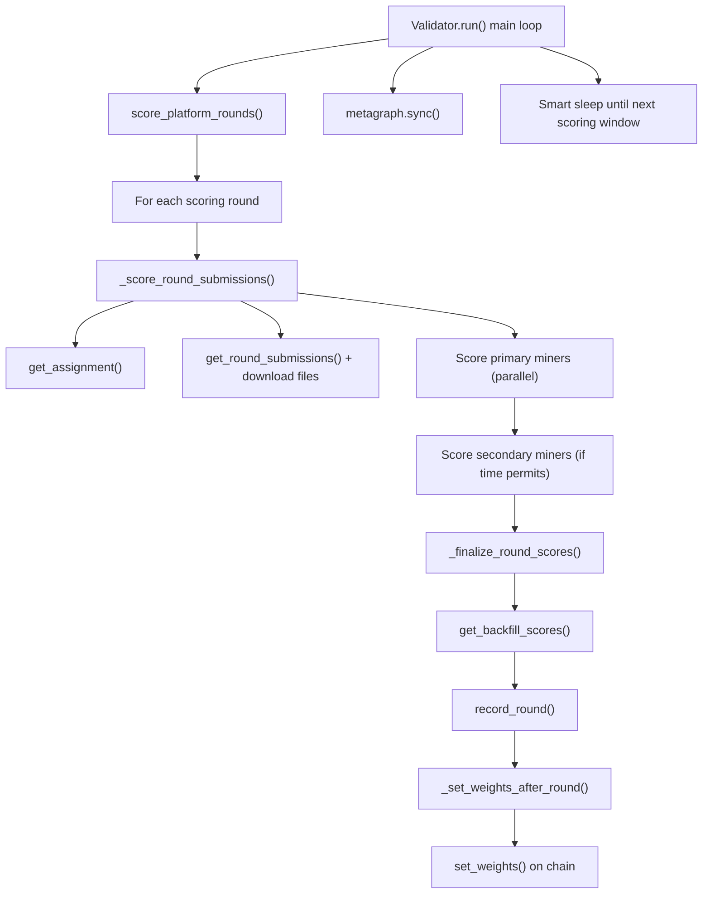
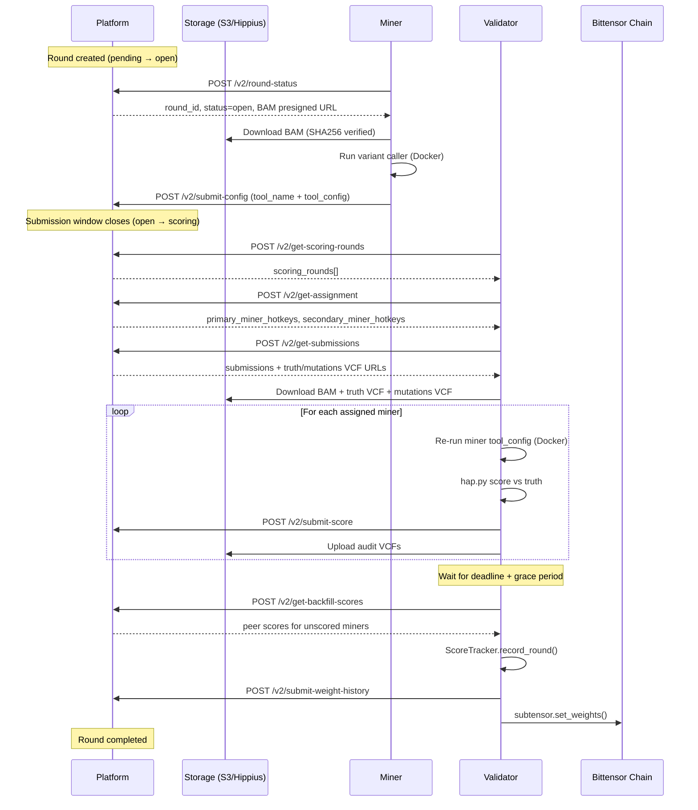

# Minos Subnet (SN107) — Validator–Miner Workflow Explained

This document explains how **miners** and **validators** work together in the Minos genomics subnet. It is written for operators who want to understand the full round lifecycle, with **diagrams**, **real code**, and **file paths with line numbers**.

---

## Table of Contents

1. [Big Picture](#1-big-picture)
2. [Important: No Classic Bittensor Synapse/Axon](#2-important-no-classic-bittensor-synapseaxon)
3. [Round Lifecycle](#3-round-lifecycle)
4. [Architecture Diagram](#4-architecture-diagram)
5. [Miner Workflow](#5-miner-workflow)
6. [Validator Workflow (Deep Dive)](#6-validator-workflow-deep-dive)
7. [Scoring Engine](#7-scoring-engine)
8. [Weight Assignment](#8-weight-assignment)
9. [Platform API Reference](#9-platform-api-reference)
10. [Sequence Diagram (End-to-End)](#10-sequence-diagram-end-to-end)

---

## 1. Big Picture

Minos is a **decentralized genomic variant-calling benchmark** on Bittensor subnet 107.

| Role | What it does |
|------|--------------|
| **Platform** | Creates rounds, hosts BAM/truth files, coordinates submissions and scores |
| **Miner** | Downloads BAM, runs variant calling (GATK / DeepVariant / BCFtools), submits **tool config only** |
| **Validator** | Re-runs each miner's config locally, scores with **hap.py**, submits scores, sets **on-chain weights** |
| **Bittensor chain** | Identity (hotkey), metagraph (UID mapping), emissions (`set_weights`) |

**Core design choice:** miners submit **configs, not VCF files**. Validators independently reproduce each miner's output. A miner cannot upload a fabricated VCF.

---

## 2. Important: No Classic Bittensor Synapse/Axon

This subnet does **not** use the classic Bittensor P2P pattern:

| Classic Bittensor | Minos SN107 |
|-------------------|-------------|
| `Synapse` subclasses | **Not used** |
| Miner runs `axon.serve()` | **Not used** |
| Validator calls `dendrite.forward()` | **Not used** |
| Direct validator → miner RPC | **Not used** |

Instead, miners and validators talk to each other **indirectly** through:

1. **Minos Platform API** (HTTPS REST, signed with wallet keypair)
2. **Object storage** (S3 / Hippius presigned URLs for BAMs and truth VCFs)
3. **Bittensor chain** (registration, metagraph sync, `set_weights`)

---

## 3. Round Lifecycle

Each round moves through four platform statuses:

```text
pending  →  open  →  scoring  →  completed
   │          │          │            │
Platform   Miners     Validators    Weights
creates    submit     score +       finalized
round      configs    backfill
```

| Status | Who acts | What happens |
|--------|----------|--------------|
| `pending` | Platform | Round created; waiting for start time |
| `open` | Miners | Poll platform, download BAM, run variant calling, submit `tool_config` |
| `scoring` | Validators | Re-run configs, score with hap.py, submit scores, backfill gaps |
| `completed` | Platform + validators | Scores aggregated; validators set chain weights |

---

## 4. Architecture Diagram



---

## 5. Miner Workflow

**Entry point:** `neurons/miner.py`

### 5.1 Startup

The miner requires Docker, loads a Bittensor wallet (or ephemeral keypair in demo mode), connects to the platform, and selects a variant-calling template.

```python
# neurons/miner.py (lines 59-123)
class Miner:
  """Minos miner - round-based variant calling."""

  def __init__(self, config=None):
    self.config = config or self.get_config()
    ...
    require_docker()
    self.demo = bool(getattr(self.config, "demo", False))

    if self.demo:
      self.wallet = None
      self.keypair = Keypair.create_from_uri(f"//demo-{secrets.token_hex(4)}")
      ...
    else:
      self.wallet = bt.wallet(config=self.config)
      self.keypair = self.wallet.hotkey
      self.subtensor = bt.subtensor(config=self.config)
      self.metagraph = self.subtensor.metagraph(self.config.netuid)
      ...

    self.setup_variant_caller()      # MINER_TEMPLATE env: gatk | deepvariant | bcftools
    self.setup_platform_client()     # PLATFORM_URL required
    self.submitted_rounds: set = set()
```

`PLATFORM_URL` is **required** for miners. Without it the process exits.

### 5.2 Main Loop

The miner polls every **30 seconds** for active rounds.

```python
# neurons/miner.py (lines 708-733)
while True:
  try:
    participated = await self.process_round()
    if participated:
      rounds_participated += 1
  except Exception as e:
    bt.logging.warning(f"Round polling error: {e}")

  await asyncio.sleep(poll_interval)   # POLL_INTERVAL_SECONDS = 30

  # Sync metagraph every 2 minutes (live mode only)
  if sync_count % 4 == 0 and self.metagraph is not None:
    self.metagraph.sync(subtensor=self.subtensor)
```

### 5.3 Per-Round Processing

`process_round()` is the heart of the miner. It:

1. Calls `POST /v2/round-status`
2. Skips if status is not `open`, already submitted, or < 10 minutes remain
3. Downloads the BAM (SHA256-verified)
4. Builds tool config from `configs/{tool}.conf`
5. Runs variant calling in Docker
6. Submits config to platform

```python
# neurons/miner.py (lines 306-387)
async def process_round(self) -> bool:
  """Check for active round and submit config if in submission window."""
  round_data = await self.platform_client.get_round_status()

  if not round_data.get("has_active_round"):
    return False

  round_id = round_data.get("round_id")
  status = round_data.get("status")
  region = round_data.get("region")
  time_remaining = round_data.get("time_remaining_seconds", 0)

  # Only participate during the open submission window
  if status != "open":
    return False

  # Need at least 10 minutes for variant calling
  if time_remaining < MIN_SUBMISSION_TIME_SECONDS:   # 600 seconds
    return False

  bam_path = self._download_bam(round_data, round_id)
  tool_config = self._get_tool_config()
  variant_count, elapsed = await self._run_variant_calling(
    bam_path, region, tool_config, output_dir, force_rerun=is_demo
  )
  return await self._submit_result(round_id, tool_config, variant_count, elapsed)
```

### 5.4 Tool Config (What Miners Actually Submit)

Miners submit **quality parameters only**. Infrastructure params (`threads`, `memory_gb`, `timeout`) are kept local and stripped before upload.

```python
# neurons/miner.py (lines 599-639)
def _get_tool_config(self) -> Dict[str, Any]:
  """Get the tool configuration for the current variant caller."""
  base_config = {
    "tool": self.variant_caller,
    "version": get_tool_version(self.variant_caller),
  }
  tool_options = extract_tool_options(self.variant_caller)

  if self.variant_caller == "gatk":
    base_config["gatk_options"] = tool_options
  elif self.variant_caller == "deepvariant":
    base_config["deepvariant_options"] = tool_options
  elif self.variant_caller == "bcftools":
    base_config["bcftools_options"] = tool_options

  return base_config
```

### 5.5 Config Submission API Call

```python
# utils/platform_client.py (lines 261-292)
async def submit_config(
  self,
  round_id: str,
  tool_name: str,
  tool_config: Dict[str, Any],
  variant_count: Optional[int] = None,
  runtime_seconds: Optional[float] = None
) -> Dict[str, Any]:
  """Submit tool configuration for a round.

  Miners submit their tool configuration instead of VCF files.
  Validators run the variant calling themselves to verify results.
  """
  # SECURITY: Strip infrastructure params before sending to platform
  _INFRA_PARAMS = {"threads", "memory_gb", "timeout", "ref_build", "num_threads"}
  safe_config = {k: v for k, v in tool_config.items() if k not in _INFRA_PARAMS}
```

---

## 6. Validator Workflow (Deep Dive)

**Entry point:** `neurons/validator.py`

The validator is the most complex component. This section walks through it step by step with real code.

### 6.1 High-Level Validator Loop



### 6.2 Validator Initialization

On startup the validator:

1. Requires Docker
2. Loads wallet + subtensor + metagraph
3. Creates `ScoreTracker`, `HappyScorer`, and `ValidatorPlatformClient`
4. Auto-tunes scoring concurrency from host CPU/RAM

```python
# neurons/validator.py (lines 136-203)
class Validator:
  """Minos validator for genomics variant calling tasks."""

  def __init__(self, config=None):
    self.config = config or self.get_config()
    require_docker()

    self.wallet = bt.wallet(config=self.config)
    self.subtensor = bt.subtensor(config=self.config)
    self.metagraph = self.subtensor.metagraph(self.config.netuid)

    self.is_registered = self.wallet.hotkey.ss58_address in self.metagraph.hotkeys
    if self.is_registered:
      self.my_subnet_uid = self.metagraph.hotkeys.index(self.wallet.hotkey.ss58_address)
    else:
      self.my_subnet_uid = None
      # Continues in demo/unregistered mode — scoring runs, weights cannot be set

    self.score_tracker = ScoreTracker(alpha=GENOMICS_CONFIG["ema_alpha"])
    self.setup_genomics_components()   # HappyScorer
    self.setup_platform_client()       # None if PLATFORM_URL unset → standalone mode
    self.use_platform = self.platform_client is not None
    self._scoring_cfg = auto_scoring_config()   # concurrency, threads, memory
```

**Auto-tuning** picks how many miners to score in parallel:

```python
# neurons/validator.py (lines 94-130)
def auto_scoring_config():
  """Size concurrent scoring jobs from host CPU/RAM."""
  cores = os.cpu_count() or 2
  ram_gb = ...  # from os.sysconf
  usable_cores = max(2, cores - 4)
  usable_ram = max(16, ram_gb - 16)
  auto_threads = min(8, max(2, usable_cores // 4))
  auto_mem_gb = 16   # DeepVariant minimum
  concurrency = max(1, int(os.getenv("MINOS_VALIDATOR_CONCURRENCY") or auto_n))
  return {"concurrency": concurrency, "threads_per_job": ..., "mem_per_job_gb": ...}
```

### 6.3 Main Run Loop

```python
# neurons/validator.py (lines 1862-1917)
async def run(self):
  """Main validator loop."""
  # Health check + restart recovery from platform
  if self.use_platform and self.platform_client:
    if await self.platform_client.health_check():
      state = await self.platform_client.get_validator_state()
      self.score_tracker.recover_from_platform_state(...)
      self.scored_rounds = set(state.get("scored_round_ids", []))

  while True:
    if self.use_platform:
      result = await self.score_platform_rounds()
      next_scoring_window = result.get("next_scoring_window_start")

    self.metagraph.sync(subtensor=self.subtensor)

    # Smart scheduling: sleep until next scoring window OR task_interval (3600s)
    if self.use_platform and next_scoring_window:
      total_wait = self._calculate_wait_until_scoring(next_scoring_window)
    else:
      total_wait = GENOMICS_CONFIG["task_interval"]
    await asyncio.sleep(total_wait)
```

### 6.4 Step 1 — Discover Scoring Rounds

```python
# neurons/validator.py (lines 350-415)
async def score_platform_rounds(self) -> dict:
  """Round-based scoring: fetch scoring rounds from platform, run miner configs, submit scores."""
  if not self.platform_client:
    return {"next_scoring_window_start": None}

  response = await self.platform_client.get_scoring_rounds()
  scoring_rounds = response.get("scoring_rounds", [])
  next_scoring_start = response.get("next_scoring_window_start")

  for round_info in scoring_rounds:
    round_id = round_info.get("round_id")
    if round_id in self.scored_rounds:
      continue   # already scored this session

    finalized = await self._score_round_submissions(round_id)
    if finalized:
      self.scored_rounds.add(round_id)

  return {"next_scoring_window_start": next_scoring_start}
```

Platform endpoint:

```python
# utils/platform_client.py (lines 363-389)
async def get_scoring_rounds(self) -> Dict[str, Any]:
  """Get all rounds currently in scoring phase (validator only)."""
  path = "/v2/get-scoring-rounds"
  body = self._auth_body("POST", path, validator_hotkey=self.keypair.ss58_address)
  response = await client.post(path, json=body, headers=self._AUTH_HEADERS)
  return response.json()
```

### 6.5 Step 2 — Score a Single Round (`_score_round_submissions`)

This is the **central orchestration function**. It runs six sub-steps:

```python
# neurons/validator.py (lines 426-584)
async def _score_round_submissions(self, round_id: str) -> bool:
  """Score submissions for a single round using subset-based assignment.

  Flow:
  1. Fetch scoring assignment from platform (primary range + secondary order).
  2. Download shared BAM + truth VCF once.
  3. Score primary miners in assignment order (no deadline pressure).
  4. Score secondary miners until 3 min before scoring deadline.
  5. After deadline, fetch backfill scores for gap miners from platform.
  6. Feed backfill scores into ScoreTracker, then record_round + set weights.
  """
```

#### 6.5.1 Get Subset Assignment

Validators do **not** score every miner. The platform assigns a **primary** subset (based on validator stake rank) plus an ordered **secondary** list.

```python
# neurons/validator.py (lines 443-467)
assignment = await self.platform_client.get_assignment(round_id)
primary_hotkeys = set(assignment.get("primary_miner_hotkeys", []))
secondary_hotkeys_ordered = assignment.get("secondary_miner_hotkeys", [])
deadline_str = assignment.get("scoring_deadline")
if deadline_str:
  scoring_deadline = datetime.fromisoformat(deadline_str.replace("Z", "+00:00"))
```

If assignment fails (e.g. single-validator testnet), the validator falls back to scoring **all** miners.

#### 6.5.2 Download Shared Round Files

One BAM + truth VCF download serves all miners in the round.

```python
# neurons/validator.py (lines 470-490)
round_data = await self.platform_client.get_round_submissions(round_id)
submissions = round_data.get("submissions", [])
region = round_data.get("region", "")

download_result = self._download_round_files(round_id, round_data)
work_dir = download_result["work_dir"]
bam_path = download_result["bam_path"]
truth_vcf_path = download_result["truth_vcf_path"]
mutations_vcf_path = download_result.get("mutations_vcf_path")
ref_path = download_result["ref_path"]
```

The download function verifies SHA256 hashes and **requires** a mutations-only VCF:

```python
# neurons/validator.py (lines 691-705)
# Download mutations-only VCF for scoring precision.
mutations_vcf_path = None
if mutations_vcf_url or mutations_vcf_url_backup:
  mutations_vcf_path = work_dir / "mutations.vcf.gz"
  if not download_file_with_fallback(...):
    return None
else:
  bt.logging.error(f"Round {round_id}: no mutations VCF URL provided by platform")
  return None
```

#### 6.5.3 Parallel Scoring with Primary/Secondary Barrier

```python
# neurons/validator.py (lines 529-575)
sem = asyncio.Semaphore(self._scoring_cfg["concurrency"])

async def _bounded_score(sub, is_secondary: bool):
  async with sem:
    if is_secondary and should_stop_secondary_scoring(scoring_deadline, buffer_seconds=180):
      return   # skip — less than 3 min before deadline
    await self._score_single_miner(round_id, sub, ...)

# Primaries first (barrier), then secondaries
if primary_hotkeys:
  await asyncio.gather(*[_bounded_score(s, False) for s in primary_subs_only])
  if not should_stop_secondary_scoring(scoring_deadline, buffer_seconds=180):
    await asyncio.gather(*[_bounded_score(s, True) for s in secondary_subs_only])
else:
  await asyncio.gather(*[_bounded_score(s, False) for s in ordered_subs])
```

Deadline helper:

```python
# utils/subset_scoring.py (lines 74-92)
def should_stop_secondary_scoring(
  scoring_end_time: Optional[datetime],
  buffer_seconds: int = 180,
) -> bool:
  """Return True if secondary miners should no longer be scored."""
  if scoring_end_time is None:
    return False
  remaining = seconds_until_deadline(scoring_end_time)
  return remaining < buffer_seconds
```

### 6.6 Step 3 — Score One Miner (`_score_single_miner`)

For each miner submission the validator:

1. Re-runs the miner's variant caller via Docker
2. Scores output VCF with hap.py
3. Computes `AdvancedScorer` combined score
4. Uploads audit VCFs to S3
5. Submits score to platform
6. Updates `ScoreTracker`

```python
# neurons/validator.py (lines 771-944)
async def _score_single_miner(self, round_id, sub, already_scored, work_dir,
                               bam_path, ref_path, ref_sdf_path, truth_bed_path,
                               truth_vcf_path, region, scored_hotkeys, submission_times,
                               mutations_vcf_path=None):
  """Run a single miner's tool, score the output, and submit results."""
  miner_hotkey = sub.get("miner_hotkey")
  tool_name = sub.get("tool_name")
  tool_config = sub.get("tool_config", {})

  miner_vcf_path = work_dir / f"miner_{miner_hotkey}.vcf.gz"

  # 1. Re-run variant calling with miner's config
  result = await self._run_miner_tool(
    tool_name=tool_name, tool_config=tool_config,
    bam_path=bam_path, ref_path=ref_path,
    output_vcf_path=miner_vcf_path, region=region
  )
  if not result.get("success"):
    return   # leave for backfill

  # 2. Score with hap.py
  metrics = self.happy_scorer.score_vcf(
    truth_vcf=str(truth_vcf_path),
    query_vcf=str(miner_vcf_path),
    reference_fasta=str(ref_path),
    region=region,
    mutations_vcf=str(mutations_vcf_path) if mutations_vcf_path else None
  )

  # 3. Compute advanced score (0-100 → 0-1 combined_final)
  advanced_score = AdvancedScorer.compute_advanced_score(metrics)
  combined_final = advanced_score / 100.0

  # 4. Submit score to platform
  score_result = await self._submit_miner_score(
    round_id, miner_hotkey, metrics, scoring_elapsed, ...
  )

  # 5. Update local score tracker
  self.score_tracker.update(miner_hotkey, combined_final)
  scored_hotkeys.append(miner_hotkey)
```

#### 6.6.1 Re-Running the Miner's Tool (Trustless Verification)

```python
# neurons/validator.py (lines 1123-1176)
async def _run_miner_tool(self, tool_name, tool_config, bam_path, ref_path,
                           output_vcf_path, region) -> dict:
  """Run a miner's variant calling tool via templates."""
  template = load_template(tool_name)

  # SECURITY: Whitelist only keys templates actually use
  ALLOWED_CONFIG_KEYS = {
    "tool", "version",
    "gatk_options", "deepvariant_options",
    "freebayes_options", "bcftools_options",
  }
  sanitized_config = {k: v for k, v in tool_config.items() if k in ALLOWED_CONFIG_KEYS}

  config = {
    **sanitized_config,
    "timeout": GENOMICS_CONFIG.get("variant_calling_timeout", 1800),
    "threads": self._scoring_cfg["threads_per_job"],
    "memory_gb": self._scoring_cfg["mem_per_job_gb"],
    "ref_build": "GRCh38",
  }

  # Run in thread pool (Docker blocks the event loop)
  loop = asyncio.get_running_loop()
  result = await loop.run_in_executor(
    None,
    lambda: template.variant_call(
      bam_path=bam_path, reference_path=ref_path,
      output_vcf_path=output_vcf_path, region=region, config=config
    )
  )
  return result
```

#### 6.6.2 Submitting Score to Platform

```python
# neurons/validator.py (lines 1261-1289)
result = await self.platform_client.submit_score(
  round_id=round_id,
  miner_hotkey=miner_hotkey,
  snp_f1=metrics.get("f1_snp"),
  snp_precision=metrics.get("precision_snp"),
  snp_recall=metrics.get("recall_snp"),
  indel_f1=metrics.get("f1_indel"),
  ...
  additional_metrics={
    "scorer": "Advanced",
    "advanced_score": advanced_score,
    "combined_final": combined_final,
    ...
  },
  validation_runtime_seconds=validation_runtime,
  output_vcf_s3_key=output_vcf_s3_key,
  happy_output_s3_key=happy_output_s3_key,
)
```

### 6.7 Step 4 — Finalize Round (`_finalize_round_scores`)

After personal scoring finishes, the validator:

1. Waits for scoring deadline + grace period
2. Fetches **backfill scores** for miners it did not personally score
3. Records round participation
4. Computes and submits weights

```python
# neurons/validator.py (lines 953-1121)
async def _finalize_round_scores(self, round_id, scored_hotkeys, submission_times, scoring_deadline):
  """Backfill gap miners from platform, record participation, then set weights."""

  # Step 1: Wait for grace period
  if scoring_deadline is not None:
    final_score_deadline = scoring_deadline + timedelta(
      seconds=score_grace_seconds + finalization_delay_seconds
    )
    wait_secs = (final_score_deadline - now).total_seconds()
    if wait_secs > 0:
      await asyncio.sleep(wait_secs + 5)

  # Step 2: Fetch backfill scores
  backfill_response = await self.platform_client.get_backfill_scores(
    round_id=round_id,
    scored_miner_hotkeys=all_scored_hotkeys,
  )
  backfill_scores = backfill_response.get("backfill_scores", [])

  # Step 3: Feed backfill into ScoreTracker
  for entry in backfill_scores:
    hk = entry.get("miner_hotkey")
    combined_final = entry.get("combined_final")
    if hk and hk not in set(all_scored_hotkeys):
      self.score_tracker.update(hk, combined_final)
      all_scored_hotkeys.append(hk)

  # Step 4: Record round participation (10-of-20 eligibility gate)
  self.score_tracker.record_round(round_id, all_scored_hotkeys)

  # Step 5: Set chain weights
  weights_finalized = await self._set_weights_after_round(round_id, submission_times)
  return weights_finalized
```

**Why backfill matters:** with subset scoring, validator A scores miners 1–50, validator B scores 41–90. After the deadline the platform reveals peer scores so every validator has a complete picture before setting weights.

### 6.8 Step 5 — Set Weights (`_set_weights_after_round`)

```python
# neurons/validator.py (lines 1297-1658)
async def _set_weights_after_round(self, round_id, submission_times=None):
  """Compute weight distribution, set on chain (if registered), POST history to platform."""
  tracked_miners = list(self.score_tracker.ema_scores.keys())

  # Fetch authoritative reward policy from platform (fail-closed if missing)
  network_cfg = await self.platform_client.get_network_config()
  burn_rate = float(network_cfg["burn_rate"])           # e.g. 0.87
  winner_weight = float(network_cfg["winner_weight"])   # e.g. 0.10
  dust_top_n = int(network_cfg["dust_top_n"])           # e.g. 10
  dust_decay = float(network_cfg["dust_decay"])

  # Build chain-eligible miner map (exclude validators, self, deregistered)
  hotkey_to_uid = {}
  for uid in range(len(self.metagraph.hotkeys)):
    if self.metagraph.validator_permit[uid]:
      continue
    hotkey_to_uid[self.metagraph.hotkeys[uid]] = uid

  # Optional canonical ranking for close-call tiebreaks
  if self.score_tracker.needs_canonical_tiebreak(...):
    canonical_response = await self.platform_client.get_canonical_ranking(round_id=round_id)
    canonical_ranking = [...]

  # Compute winner + dust distribution
  weights = self.score_tracker.get_winner_heavy_pruning_dust_weights(
    chain_eligible_tracked_miners, submission_times,
    burn_rate=burn_rate, winner_weight=winner_weight,
    dust_top_n=dust_top_n, dust_decay=dust_decay,
    canonical_ranking=canonical_ranking,
  )

  # Add burn weight
  burn_weight = max(0.0, 1.0 - sum(weights.values()))
  weights[burn_hotkey] = weights.get(burn_hotkey, 0.0) + burn_weight

  # POST weight history to platform (always — dashboard telemetry)
  await self.platform_client.submit_weight_history(round_id, validator_hotkey, entries)

  # Set weights on chain (only if registered)
  if self.is_registered:
    chain_success = await loop.run_in_executor(None, self.set_weights, chain_weights, hotkey_to_uid)
```

### 6.9 Step 6 — Chain Weight Submission (`set_weights`)

```python
# neurons/validator.py (lines 1665-1756)
def set_weights(self, weights_by_hotkey, hotkey_to_uid, retry_count=0):
  """Set weights on the blockchain."""
  miner_uids = []
  miner_weights = []
  for hk in miner_hotkeys:
    miner_uids.append(hotkey_to_uid[hk])
    miner_weights.append(weights_by_hotkey.get(hk, 0.0))

  total = sum(miner_weights)
  if total <= 0:
    # Fail closed — never silently distribute equal weights
    bt.logging.error("WEIGHT SAFETY: all computed weights are zero — skipping")
    return False
  if abs(total - 1.0) > 1e-6:
    bt.logging.error(f"WEIGHT SAFETY: weights sum to {total:.8f}, expected 1.0")
    return False

  uids_array = np.array(miner_uids, dtype=np.int64)
  weights_array = np.array(miner_weights, dtype=np.float32)

  return self._set_weights_direct(uids_array, weights_array, retry_count)
```

```python
# neurons/validator.py (lines 1818-1826)
success, msg = self.subtensor.set_weights(
  wallet=self.wallet,
  netuid=self.config.netuid,
  uids=uids,
  weights=weights,
  wait_for_finalization=False,
  wait_for_inclusion=True,
  version_key=__SPEC_VERSION__,
)
```

---

## 7. Scoring Engine

### 7.1 hap.py (`HappyScorer`)

Validators compare the re-run VCF against the private truth VCF using hap.py in Docker.

```python
# utils/scoring.py (lines 542-556)
class HappyScorer:
  """Score VCF outputs using hap.py."""

  def score_vcf(self, truth_vcf, query_vcf, reference_fasta=None,
                confident_bed=None, region=None, reference_sdf=None,
                mutations_vcf=None) -> Optional[Dict[str, float]]:
    """Run hap.py and return precision/recall/F1 metrics.

    Args:
      mutations_vcf: Path to mutations-only VCF. Required for accurate scoring.
    """
```

hap.py returns SNP/INDEL precision, recall, F1, Ti/Tv ratio, Het/Hom ratio, and more.

### 7.2 AdvancedScorer (0–100 Final Score)

```python
# utils/scoring.py (lines 928-1027)
@staticmethod
def compute_advanced_score(metrics: Dict[str, float]) -> float:
  """Compute advanced score with four components.

  Components:
  - Core (60%): Truth-weighted F1 with emphasis (γ=0.5)
  - Completeness (15%): Average recall (γ=3.0) + coverage (γ=2.0)
  - FP Rate (15%): Penalizes FP > target and call count != truth count
  - Quality (10%): Ti/Tv and Het/Hom ratio match penalties

  Returns:
    Final score (0-100)
  """
  weighted_f1 = (f1_snp * truth_total_snp + f1_indel * truth_total_indel) / total_truth
  core_component = AdvancedScorer.emphasis(weighted_f1, gamma=0.5)
  ...
  final_score = 100.0 * (
    0.60 * core_component +
    0.15 * completeness_component +
    0.15 * fp_component +
    0.10 * quality_component
  )
  return max(0.0, final_score - overcall_penalty)
```

The validator converts this to `combined_final = advanced_score / 100.0` (range 0–1) for weight ranking.

---

## 8. Weight Assignment

### 8.1 ScoreTracker

```python
# utils/weight_tracking.py (lines 58-87)
class ScoreTracker:
  """Track current-round scores plus recent-window participation counts.

  ``ema_scores`` stores the current round's combined_final score.
  """
  def __init__(self, alpha=None, min_rounds=MIN_PARTICIPATION_ROUNDS, ...):
    self.ema_scores: Dict[str, float] = {}        # hotkey → current round score
    self.round_history: List[dict] = []             # for 10-of-20 eligibility gate
```

**Eligibility gate:** miners must be scored in **≥ 10 of the last 20 rounds** to receive weight.

```python
# utils/weight_tracking.py (lines 192-194)
def is_eligible(self, hotkey: str) -> bool:
  return self.get_participation_count(hotkey) >= self.min_rounds
```

### 8.2 Winner-Heavy + Pruning Dust Policy

Default policy (from platform `network-config`):

| Recipient | Share | Description |
|-----------|-------|-------------|
| Burn UID | ~87% | Subnet burn |
| Round winner | ~10% | Highest current-round score (eligible miners only) |
| Ranks #2–#10 | ~3% | Geometric dust decay |

```python
# utils/weight_tracking.py (lines 245-337)
def get_winner_heavy_pruning_dust_weights(self, miner_hotkeys, submission_times, *,
    burn_rate, winner_weight, dust_top_n, dust_decay, canonical_ranking=None):
  ranked = self._ranked_positive_eligible(miner_hotkeys, submission_times)
  winner = ranked[0]

  # Canonical tiebreak for close scores
  if canonical_candidates:
    for candidate in canonical_candidates:
      gap = top_score - canonical_score
      if gap <= CANONICAL_TIEBREAK_TOLERANCE:
        winner = candidate
        break

  weights[winner] = winner_weight
  dust_pool = max(0.0, miner_budget - winner_weight)
  dust_recipients = [hk for hk in ranked if hk != winner][:dust_top_n - 1]
  dust_raw = [dust_decay ** i for i in range(len(dust_recipients))]
  for hk, raw in zip(dust_recipients, dust_raw):
    weights[hk] = dust_pool * raw / dust_total
  return weights
```

**Tiebreak order:** highest `combined_final` → earliest `submitted_at` → canonical platform ranking (for close calls).

---

## 9. Platform API Reference

### 9.1 Authentication

Every request is signed with the Bittensor wallet keypair:

```python
# utils/platform_client.py (lines 105-117)
@staticmethod
def sign_request(keypair, method, path, body, timestamp, nonce) -> str:
  """Canonical string: METHOD|PATH|BODY_HASH|TIMESTAMP|NONCE"""
  canonical_body = {k: v for k, v in sorted(body.items()) if k not in ("signature", "nonce")}
  body_hash = hashlib.sha256(json.dumps(canonical_body, sort_keys=True, separators=(',', ':')).encode()).hexdigest()
  canonical = f"{method.upper()}|{path}|{body_hash}|{timestamp}|{nonce}"
  return keypair.sign(canonical.encode()).hex()
```

### 9.2 Miner Endpoints

| Method | Path | Purpose |
|--------|------|---------|
| POST | `/v2/round-status` | Get active round + BAM URLs |
| POST | `/v2/submit-config` | Submit tool config |
| POST | `/v2/demo/round-status` | Demo sandbox round status |
| POST | `/v2/demo/submit-result` | Demo sandbox submission |

### 9.3 Validator Endpoints

| Method | Path | Purpose |
|--------|------|---------|
| POST | `/v2/get-scoring-rounds` | Rounds in `scoring` phase |
| POST | `/v2/get-assignment` | Subset scoring assignment |
| POST | `/v2/get-submissions` | All miner submissions + presigned URLs |
| POST | `/v2/submit-score` | Per-miner hap.py metrics |
| POST | `/v2/submit-variant-results` | Per-variant audit breakdown |
| POST | `/v2/get-backfill-scores` | Peer scores after deadline |
| POST | `/v2/submit-weight-history` | Dashboard telemetry |
| POST | `/v2/get-validator-state` | Restart recovery |
| POST | `/v2/get-upload-url` | Presigned S3 PUT for audit files |
| GET | `/scoring/network-config` | Burn/winner/dust policy |
| GET | `/scoring/canonical-ranking` | Stake-weighted tiebreak ranking |
| GET | `/health` | Health check |

---

## 10. Sequence Diagram (End-to-End)



---

## Quick Reference — Key Source Files

| File | Role |
|------|------|
| `neurons/validator.py` | Validator entry, scoring orchestration, chain weights |
| `neurons/miner.py` | Miner entry, round polling, config submission |
| `utils/platform_client.py` | Signed REST client for all platform endpoints |
| `utils/scoring.py` | `HappyScorer` (hap.py) + `AdvancedScorer` |
| `utils/weight_tracking.py` | `ScoreTracker` — participation gate, winner+dust weights |
| `utils/subset_scoring.py` | Deadline helpers for primary/secondary scoring |
| `templates/gatk.py` (etc.) | Docker-based `variant_call()` implementations |
| `docs/architecture.md` | Authoritative architecture reference |

---

## How to Run

```bash
# Validator
bash start-validator.sh
# or: python -m neurons.validator

# Miner
bash start-miner.sh
# or: python -m neurons.miner
```

Required environment variables:

- **Both:** `WALLET_NAME`, `WALLET_HOTKEY`, `NETUID=107`, `PLATFORM_URL`
- **Miner:** `MINER_TEMPLATE=gatk|deepvariant|bcftools`
- **Validator:** Docker + reference datasets under `datasets/reference/`

See `.env.validator.example` and `.env.miner.example` for full configuration.
